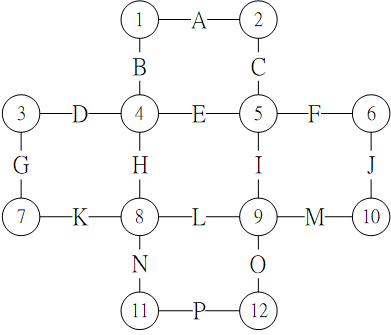

# hw3
```
A mathematical expression is given without parentheses. Design an algorithm to
parenthesize the expression such that the value of the expression is maximized.
For example, consider the expression: 2+7*5. There are two ways to parenthesize
the expression 2+(7*5) = 37 and (2+7)*5 = 45, so in this case, your algorithm
should output the second expression. Here, you may assume the given expressions
contain only 3 kinds of binary operators ‘+’, ‘-’, and ‘*’.  
  
Input: expression Ex: 2+7*5-3*6  
Output: (((2+7)*5)-3)*6 or ((((2+7)*5)-3)*6)
  
1 <= expression's length <= 30  
if there are several solutions, output one of them.  
```
# hw4
```
Huffman encoding  
Input: First line containing a single integer N,  
Each of the next N lines is a alphabet and it's frequency.  
Ex.  
4  
a 45  
b 13  
c 12  
d 16  
e 9  
f 5  
  
Output: binary character code  
a 0  
b 101  
c 100  
d 111  
e 1101  
f 1100  
```
# hw5
```
Given an undirected graph G(V,E), determine whether there is a Eulerian Circuit in G.  
If there is a Eulerian Circuit in G, Output the first lexicographical order(字典序) circuit
else, Output "not exist"  
|V| <= 1000 , |E| <= 100000  
Example:  
  
Input: first line contains two integers |V| and |E|, following |E| lines are the edge(u,v) ∈ G  
12 16  
1 2  
1 4  
2 5  
3 4  
4 5  
5 6  
3 7  
4 8  
5 9  
6 10  
7 8  
8 9  
9 10  
8 11  
9 12  
11 12  
Output: the first lexicographical order Eulerian circuit if exists, "not exist" if not exists  
1 2 5 4 3 7 8 9 5 6 10 9 12 11 8 4 1  
```